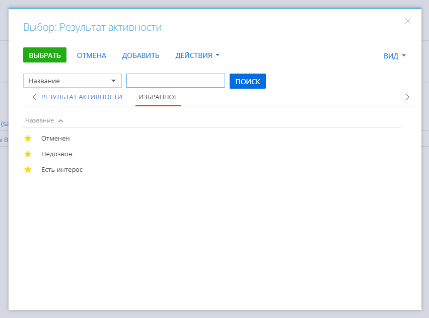
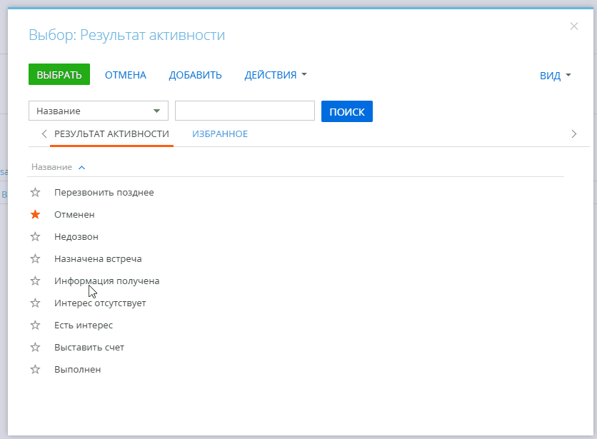

# Модуль "Избранное" для справочников Creatio / Favorites Module for Creatio Lookups

## Русский

### Описание
Этот модуль расширяет функциональность системы Creatio, добавляя возможность добавлять записи справочников в "Избранное" для быстрого доступа. Больше не нужно тратить время на поиск часто используемых записей!

### Возможности
-   Добавление записей справочников в "Избранное" одним кликом.
-   Отображение списка "Избранное" в одном окне со справочником.
-   Удобное управление избранными записями: добавление, удаление.
-   Простота установки и настройки.

### Скриншоты


### Демонстрация


### Сборка
`clio generate-pkg-zip LookupFavorites`

Полученный архив можно установить в Creatio, используя clio или интерфейс установки приложений.

### Настройка
Для использования на любой карточке достаточно добавить в атрибут поля, для которого вызывается справочник, значение `isFavoritesLookup`

```
attributes: {
	Result: {
		isFavoritesLookup: true,
	},
},
```

### Совместимость
Пакет протестирован на версии
-   7.18.5

### Зависимости
1. Base
2. UIv2
3. NUI

---

## English

### Description
This module extends Creatio system functionality by adding the ability to bookmark lookup records as "Favorites" for quick access. No more wasting time searching for frequently used records!

### Features
-   Add lookup records to "Favorites" with a single click.
-   Display the "Favorites" list in the same window as the lookup.
-   Convenient management of favorite records: adding, removing.
-   Easy installation and configuration.

### Screenshots


### Demonstration


### Build
`clio generate-pkg-zip LookupFavorites`

The resulting archive can be installed in Creatio using clio or the application installation interface.

### Configuration
To use on any card, simply add the value `isFavoritesLookup` to the attribute of the field for which the lookup is called.

```
attributes: {
	Result: {
		isFavoritesLookup: true,
	},
},
```

### Compatibility
The package has been tested on version
-   7.18.5

### Dependencies
1. Base
2. UIv2
3. NUI
